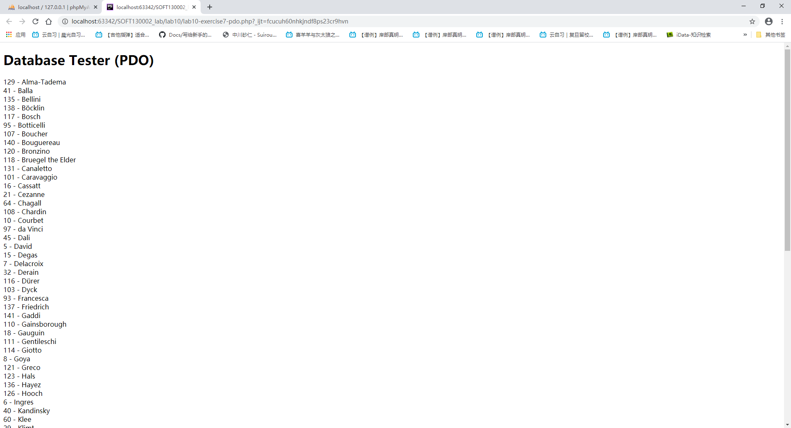
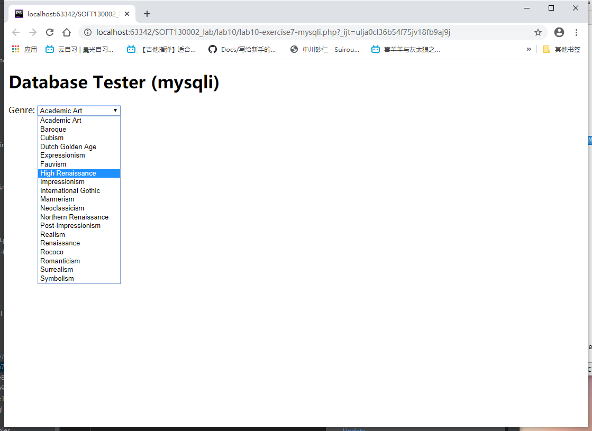
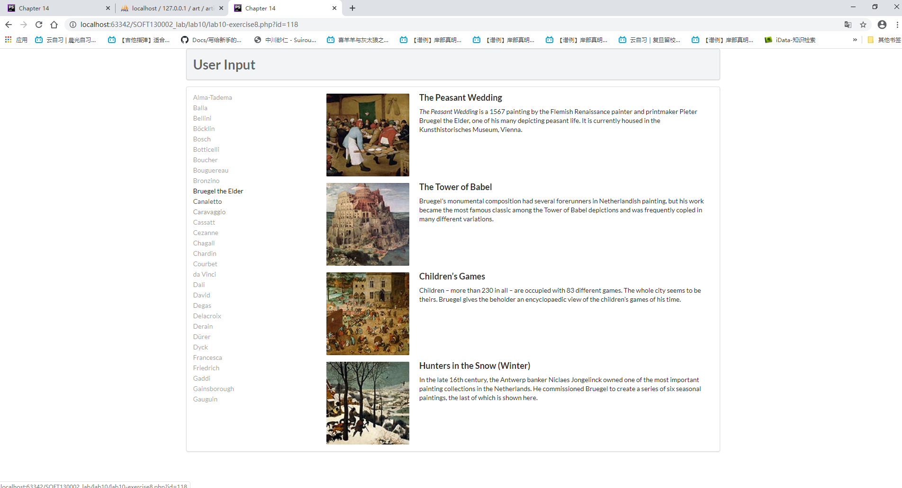
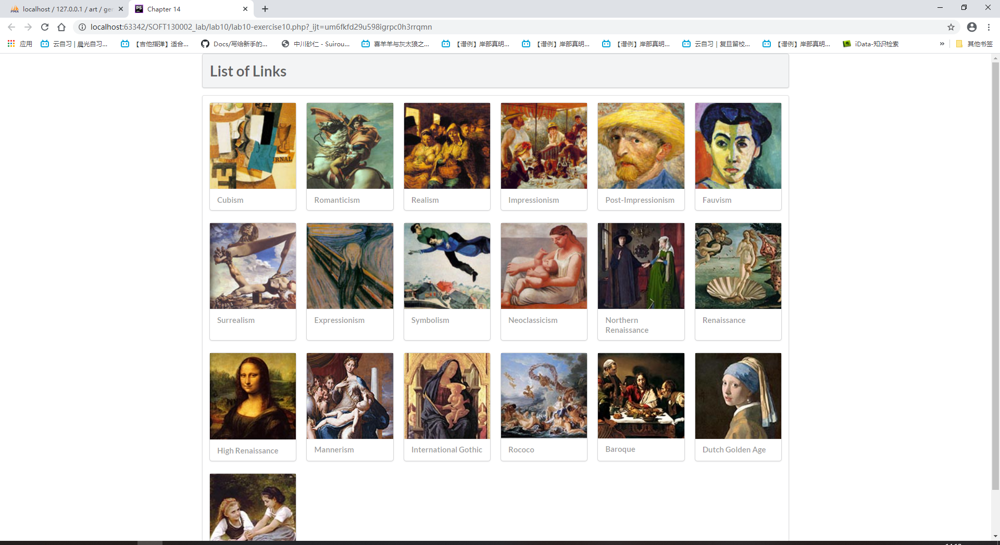
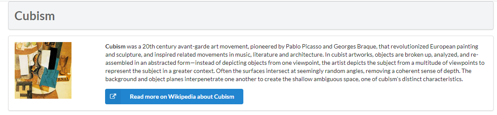

****#2020年Web应用基础 lab10

18300200008张明

## exercise7连接数据库

** 准备工作 **
参数在config.php中以预先定义好

```php
<?php
define('DBHOST', 'localhost');
define('DBNAME', 'art');
define('DBUSER', 'testuser');
define('DBPASS', 'zm20000727');
define('DBCONNSTRING','mysql:dbname=art;charset=utf8mb4;');
?>
```

因此需要在使用前先引入，之后便可以直接调用变量

```php
<?php require_once('config.php'); ?>
```
*** PDO ***

PDO(PHP Data Objects),是PHP中与数据库连接的接口

**** 1.运用这个方法，需要创建一个PDO类的实例来完成连接： ****

```php
<?php
try {
  $pdo = new PDO(DBCONNSTRING,DBUSER,DBPASS);  //这里使用了预定义的常量作为参数传入，分别代表着名称、用户名、密码
  ...}

```

**** 2.若数据库连接出错，将抛出PDOException异常对象，故使用try-catch语句 ****

```php
try{...}catch (PDOException $e) { 
    die( $e->getMessage() );
}
```

设置错误处理模式

```php
  $pdo->setAttribute(PDO::ATTR_ERRMODE, PDO::ERRMODE_EXCEPTION);  
```
通过调用PDO对象的setAttribute函数，自定义错误处理模式


**** 3.进行数据库搜索 ****

```php
  $sql = "select * from Artists order by LastName";
  $result = $pdo->query($sql);
```

前一句定义了将在MySQL中检索所使用的语句,参照exercise1-6中的语句结构，可知搜索到的内容是以LastName（首字母）作为排序方式的

再使用PDO对象的query方法，得到PDOStatement形式的返回值(失败返回false)

**** 4.搜索结果显示 ****

```php
  while ($row = $result->fetch()) {
      echo $row['ArtistID'] . " - " . $row['LastName'] . "<br/>"; 
  }
  $pdo = null; 
}
```

PDOStatament对象的fetch方法，将检索结果的下一条返回，当找不到下一个条时return false 即读取结束

每行读取中打印相应的ArtistID属性、LastName属性，多行输出，最后将pdo删除


*** mysqli ***



**** 1.运用这个方法，首先要创建一个链接 即connection ****

```php
$connection = mysqli_connect(DBHOST, DBUSER, DBPASS, DBNAME);
```

注意与PDO方法不同的时传入参数时将主机、数据库名拆开分别作为首、末参数


**** 2.创建链接时，成功与否将直接反映在mysqli_connect_error()上 ****

```php
if ( mysqli_connect_errno() ){
	die( mysqli_connect_error() );
	}
```

成功则返回0，失败将返回相应的错误数值并直接结束脚本


**** 3.进行数据库搜索 ****

```php
$sql = "select * from Genres order by GenreName";
$result = mysqli_query($connection, $sql);
```

同样，利用MySQL检索语句进行搜索，只不过从PDO->query()方法变为mysqli_query(数据库链接,检索语句)方法

返回值为mysqli_result对象， return false 读取结束

**** 4.搜索结果显示 ****

```php
while($row = mysqli_fetch_assoc($result)) {
	echo '<option value="' . $row['GenreID'] . '">';
    echo $row['GenreName'];
    echo "</option>";
    }
```
同样使用循环检索，注意这个方法的检索结果会写为option标签，结束后关闭result对象以及数据库连接

## exercise8


解释三个函数：

**** 1.html结构 ****
左边为画家选择区，与outputArtists()联动

右边为作品展示区，根据选择的作家，与OutputPaintings()联动

outputSinglePainting()则封装一部分代码，在putputPaintings()中调用

**** 2.outputArtists() ****

采用PDO方式连接数据库

```php
"$sql = select * from Artists order by LastName limit 0,30";
$result = $pdo->query($sql);
```
检索30位艺术家并按按LastName（首字母）排序

在<a>标签中打印，使结果具有url的特性：

```php
echo '<a ... "class="';
if (isset($_GET['id']) && $_GET['id'] == $row['ArtistID']) echo 'active ';
```

其中$_GET使用超全局变量，获取url参数传递内容,isset()函数检测此变量是否设置

**** 3.outputPaintings() ****

同样采用PDO方式连接数据库

和outputArtist()函数类似，根据url参数来检索对应艺术家的数据

```php
$sql = 'select * from Paintings where ArtistId=' . $_GET['id'];
            $result = $pdo->query($sql);
            while ($row = $result->fetch()) {
                outputSinglePainting($row);
            }
```

检索结果每一行包含一幅作品，传参给outputSinglePainting()输出

**** 4.outputSinglePainting() ****

用来输出图片、标题、摘要与相应的html元素

## exercise9

使用 Prepared Statements

```php
$statement = $pdo->prepare($sql);
          $statement->bindValue(':id', $id);
          $statement->execute();

```
以下摘自百度：
PDO::prepare(sql检索语句)返回PDOStatement对象，但并不马上执行

PDOStatement::bindValue('名',值)则可以才prepare之后赋值，改变sql检索语句实际内容

PDOStatement::execute()最终执行，得到检索结果

优势：

此方法可以降低代码耦合程度，先准备语句大概结构，随后确定具体内容，也可以复用


## exercise10



**** 1.outputGenres() ****

类似exercise8中的函数

连接数据库、拿到genre信息，循环中每个都传参给outputSingleGenre()

**** 2.outputSingleGenre() ****

echo图片内容与对应的html结构

**** 3.constructGenreLink($id,$label) ****

为传入的label(html元素)添加a标签框

并添加链接，跳转到对应详细页面，即


