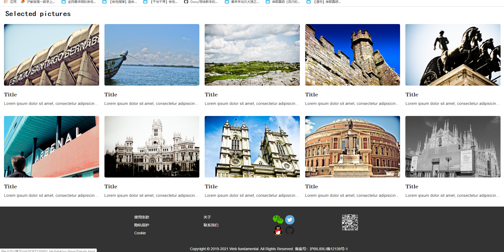

本次作业采用了BootStrap布局中的：
1.响应式导航栏 navbar-inverse
2.轮播图 carousel 
3.页脚 footer

主界面采用的布局为：
同时运用在PJ1中的Grid布局
可以实现响应式分布，使Grid的行列数随着浏览器窗口尺寸的变化而变化

<<<<<<< HEAD
主页如图：
=======
主页如图：i
>>>>>>> 2a5098568ef76d90623bde477b95484cd78a7935

