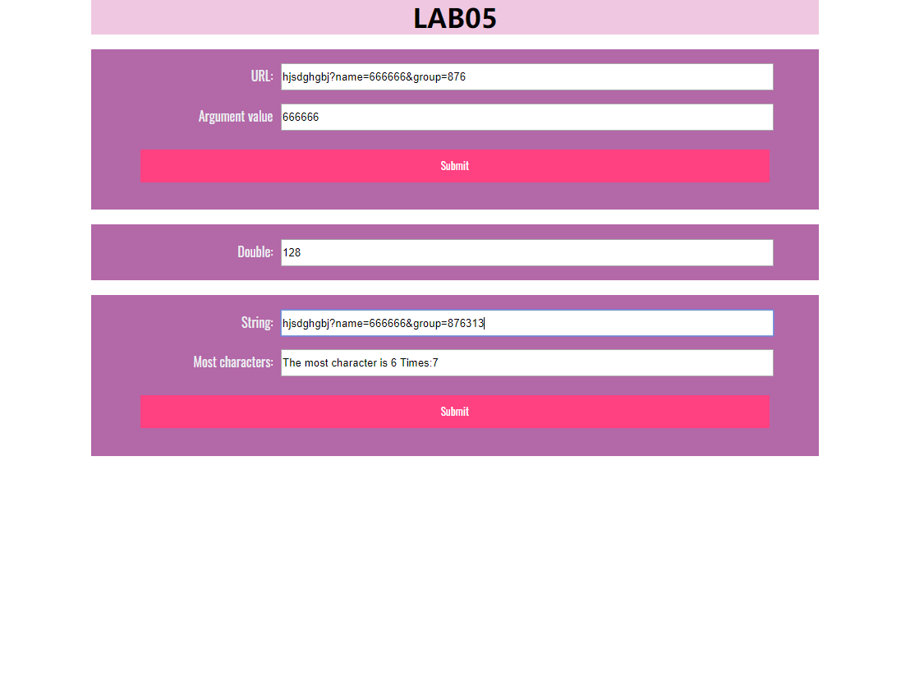

# Lab5设计文档
## 总结
第一题
	主要使用了substring函数，具体操作：
	截取str中“name=”到“&之间的部分”，把这部分命名为str1
	再截取str1中下标为=号+1的剩余部分，这部分即为name的参数
第二题
	主要利用setInterval方法设置5秒的间隔，每隔五秒执行一次让值翻倍的函数
	若是时间到达了某一整分钟，或者运行了十次，则触发clearInterval()函数使计时器停止
第三题
	构造了一个数组json
	遍历这个数组
	如果这个字符串中的字符不在json中，就让它为1
	如果它在json中就+1
	最后初始化出现最多的字符Index与其值max
	最后找到json中的最大值，其值即为max，此时的j就是index

完成网页效果图：
