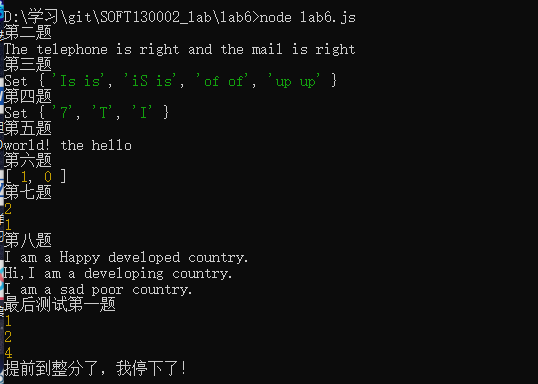
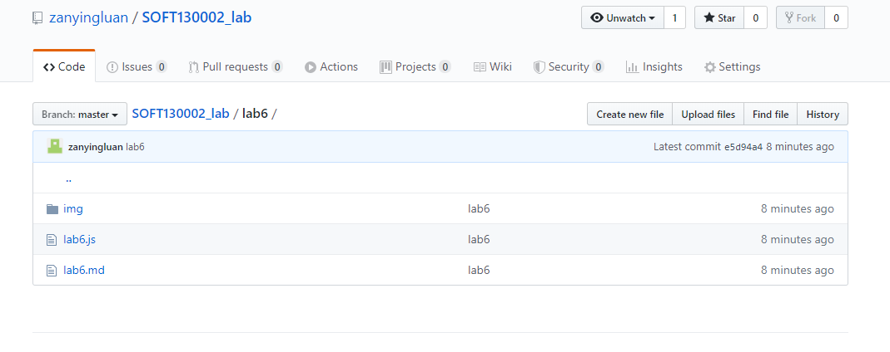

# lab6设计文档

>张明 18300200008

##关于正则表达式的理解

###第二题
	1. /^1\d{10}$/ 指1开头的11位数字
	2. /^([^\x00-\x20\x22\x28\x29\x2c\x2e\x3a-\x3c\x3e\x40\x5b-\x5d\x7f-\xff]+|\x22([^\x0d\x22\x5c\x80-\xff]|\x5c[\x00-\x7f])*\x22)(\x2e([^\x00-\x20\x22\x28\x29\x2c\x2e\x3a-\x3c\x3e\x40\x5b-\x5d\x7f-\xff]+|\x22([^\x0d\x22\x5c\x80-\xff]|\x5c[\x00-\x7f])*\x22))*\x40([^\x00-\x20\x22\x28\x29\x2c\x2e\x3a-\x3c\x3e\x40\x5b-\x5d\x7f-\xff]+|\x5b([^\x0d\x5b-\x5d\x80-\xff]|\x5c[\x00-\x7f])*\x5d)(\x2e([^\x00-\x20\x22\x28\x29\x2c\x2e\x3a-\x3c\x3e\x40\x5b-\x5d\x7f-\xff]+|\x5b([^\x0d\x5b-\x5d\x80-\xff]|\x5c[\x00-\x7f])*\x5d))*(\.\w{2,})+$/ 指有顶级域的邮箱
	关于这个是我借助lab2Ta所给的正则表达式，因为能力有限，对于它的理解我咨询了袁乐天同学，他告诉我这个东西要提取一些公共部分将其化简，听得我云里雾里没有明白，所以我也希望TA能够答疑解惑。
	我个人认为的邮箱形式可以用下面这个正则表达式表示，当然也是网上查的
	邮箱的第一位是数字字母，接下来是数字字母下划线小数点横杠，然后是@，接下来就是字母加小数点穿插，最后一个小数点后面的字母是2-4位
	3./^\w[\w_\.-]*@[a-zA-Z\.]+\.[a-zA-Z]{2,4}$/
	
###第三题
	这题参考了网上的一种方法：
	将str中的每个单词放进Set中，在遍历了后动态合成了一个正则表达式
	最后利用RegExp对象执行gi匹配
	具体如下：
	```js
	let wordSet = new Set(str.split(" "));
    let regExpStr = '';
    for(let value of wordSet){ //遍历wordSet，将str分割好，最终得到一个最终模式的regExpstr字符串
        let newSubStr = "(" + value + " " +value + ")";
        regExpStr += newSubStr + "|"
    }
    regExpStr = regExpStr.substring(0,regExpStr.length - 1);
    let reg = new RegExp('^' + regExpStr + '$','gi');//利用RegExp对象执行对大小写不敏感的，全局的匹配
    let result = str.match(reg);
	```

###第四题到第七题
	1.第四题使用Set，我猜是为了简化重复字母过多的情况，这也体现了set的不能包含重复元素的特性。
	2.第五题使用了Array的几个方法，如reverse()和trim()，最后使用join()和replace()输出符合题意的字符串。
	3.第六题和第七题利用了Map对象，这一对象是我之前没有见到过的可以储存键值对的集合。目前想到的是可以降低时间复杂度。

###第八题
	继承的三种方式
	1.借用构造函数
    *在子类构造方法中利用call方法将父类构造函数中的this都指向子类，可以利用父类构造函数中定义的属性。
    
  	2.原型链继承
    * 原型链继承主要特点是利用父类的一个实例作为子类的prototype。
    
 	3.原型式继承
    * 从现有的对象中创建新对象，不必创建自定义类型，可以不用创建构造函数就能实现继承。
 
截图:
//本地截图

//github上传截图
